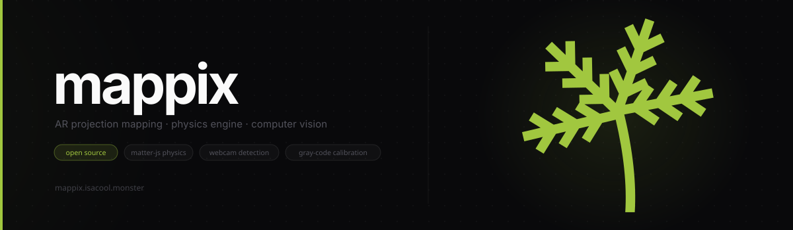
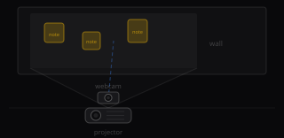

# Mappix



Stick notes on a wall. Watch physics balls bounce off them. That's it. That's the project.

**[→ Open Mappix](https://mappix.isacool.monster/)** — no install, just open in the browser on the machine driving the projector.

---

## What You Need

- A projector aimed at a wall
- A webcam with a clear view of the same wall
- Some yellow sticky notes — or any bright object; yellow is just the default (configurable in settings)

The webcam and projector don't need to be perfectly aligned — that's what calibration is for.

---

## Hardware Setup

<div align="center">
  <a href="https://github.com/user-attachments/assets/bd8cbd01-6d11-4f0d-8ec1-abe6f2bbecca">
    
  </a>
</div>

1. Mount your projector so it covers the wall area you want to use
2. Position the webcam so it can see the full projected area — off to the side or above works fine
3. Make sure the room isn't so bright that the projector image washes out; the camera needs to read the patterns during calibration

---

## Calibration

Calibration maps every projector pixel to its corresponding camera pixel using a Gray-code structured light sequence. You only need to redo this if the projector or camera moves.

1. Clear the wall of people and moving objects
2. Click **Calibrate** in the sidebar
3. The projector will flash a series of black-and-white stripe patterns for ~7 seconds — don't cover the wall during this
4. When it finishes, a quality score is shown. Anything above 60% is solid; re-run if it's lower
5. Calibration is saved to `localStorage` — it persists across page reloads

> If you just want to try it quickly, hit **Skip** instead. The app will use proportional scaling, which works reasonably well when the camera is centred and close to the projector.

---

## Running

1. Stick yellow post-its on the wall (or hold up any yellow object)
2. Click **Start** and grant camera permission
3. Balls start falling from the top and bounce off whatever the camera detects
4. Tune detection sensitivity from the sidebar if objects aren't being picked up — adjust **Hue Range**, **Sat Min**, and **Val Min** to match your lighting


## Running Locally (Optional)

```bash
git clone https://github.com/mishalshanavas/mappix.git
cd mappix
npm install
npm run dev
```

Open `http://localhost:5173` in the browser on the machine driving the projector.

---

> Full hardware guide, calibration tuning, and troubleshooting coming in the wiki.
